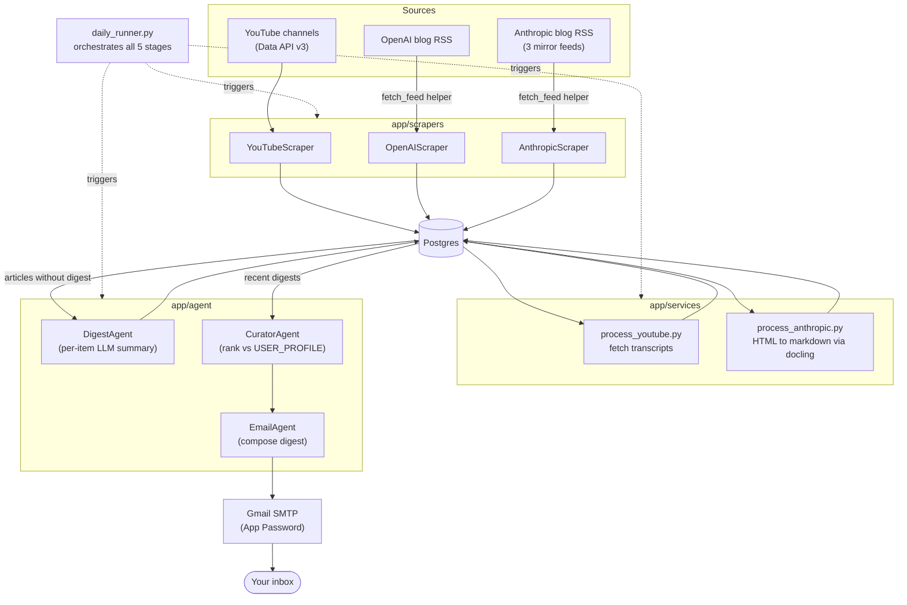

# AI News Aggregator

A daily pipeline that scrapes AI news from YouTube, OpenAI, and Anthropic, summarizes and ranks it against a personal interest profile using an LLM, and emails a curated digest — so you can decide what's worth reading/watching without checking five different sources yourself.

## What it does

Every day, the pipeline:

1. **Scrapes** new videos/articles from configured YouTube channels, the OpenAI blog, and Anthropic's blog (news/research/engineering)
2. **Enriches** each item — pulls YouTube transcripts, converts Anthropic/OpenAI article pages to markdown
3. **Summarizes** each new item into a short digest via an LLM (Groq)
4. **Ranks** all digests from the last N hours against a user interest profile
5. **Emails** the top N as a single digest, with reasoning for why each item was ranked where it was

## Architecture



## Setup

### 1. Clone and install dependencies

```bash
git clone <https://github.com/aaquibmomin2003/AI_NEWS_AGGREGATOR>
cd ai-news-aggregator
uv sync
```

### 2. Postgres

Create a local database (or point at a hosted one):

```bash
createdb ai_news
```

### 3. Environment variables

Create a `.env` file in the project root:

```dotenv
# Postgres
POSTGRES_HOST=localhost
POSTGRES_PORT=5432
POSTGRES_DB=ai_news
POSTGRES_USER=postgres
POSTGRES_PASSWORD=your_password

# YouTube Data API v3 — console.cloud.google.com → enable "YouTube Data API v3" → Credentials → API key
YOUTUBE_API_KEY=your_key

# LLM provider for summarization/ranking
GROQ_API_KEY=your_key

# Gmail — requires an App Password, NOT your regular login password.
# Enable 2-Step Verification first, then generate one at
# myaccount.google.com/apppasswords
SMTP_HOST=smtp.gmail.com
SMTP_PORT=587
SMTP_USER=your_address@gmail.com
SMTP_PASSWORD=your_16_char_app_password
EMAIL_TO=where_to_send_the_digest@example.com

# Optional — Webshare proxy for YouTube transcript fetching, if you hit
# IP-based rate limits on youtube_transcript_api
PROXY_USERNAME=
PROXY_PASSWORD=
```

### 4. Configure tracked channels

Edit `app/config.py`:

```python
YOUTUBE_CHANNELS = [
    "UCawZsQWqfGSbCI5yjkdVkTA",   # Matthew Berman
    "UCbY9xX3_jW5c2fjlZVBI4cg",   # TheAIGRID
    "UCNJ1Ymd5yFuUPtn21xtRbbw",   # AI Explained
    "UChpleBmo18P08aKCIgti38g",   # Matt Wolfe
]
```

### 5. Run the tests

```bash
uv run pytest -v
```

All scraper/fetch tests run fully mocked — no network, no live credentials required.

### 6. Run the pipeline

```bash
uv run python -m app.daily_runner
```

## Scheduling

Not yet automated. To run daily:

- **Windows:** Task Scheduler → trigger `uv run python -m app.daily_runner` once a day
- **Linux/macOS:** a cron entry, e.g. `0 8 * * * cd /path/to/project && uv run python -m app.daily_runner`

## Design decisions worth knowing

A few non-obvious things this pipeline had to work around, in case you're extending it:

**YouTube: RSS feed abandoned in favor of the Data API.** The public `youtube.com/feeds/videos.xml` endpoint looks convenient, but under repeated automated requests it returned inconsistent errors (500, then 404, for the identical URL within minutes) — YouTube's anti-bot layer, not a real outage. It also silently caps at ~15 entries per channel with no pagination. `YouTubeScraper` now uses `playlistItems.list` against the channel's uploads playlist (derived by swapping the `UC` channel-ID prefix for `UU` — no extra API call needed), which paginates properly and isn't subject to the same blocking.

**RSS fetching goes through `requests`, not feedparser's own fetcher.** `feedparser.parse(url)` uses `urllib` internally, which failed with an expired-certificate SSL error on at least one dev machine, and sends no real User-Agent (which some servers, including YouTube's HTML endpoints, respond to differently than a browser-like client). `app/utils/feed_fetch.py` fetches the raw bytes via `requests` (proper headers, retries with backoff on transient 5xx/connection errors) and hands them to `feedparser` purely for parsing.

**Anthropic's blog feed only has date-level precision, not real timestamps.** The mirror feed used for Anthropic content records every article as published at `00:00:00 UTC` on its date. Comparing that against an exact rolling-hour cutoff means an article from "today" can be incorrectly excluded depending on what hour the pipeline happens to run. `AnthropicScraper.get_articles` detects midnight-only timestamps and falls back to comparing calendar dates instead of exact datetimes in that case.

**Gmail requires an App Password, not the account password.** SMTP login fails with a `534` error otherwise. Needs 2-Step Verification enabled first.

## Roadmap

- [ ] Semantic deduplication across sources (same story covered by a video + an article shouldn't produce two separate digest entries)
- [ ] Persistent run-history table (`pipeline_runs`) for observability instead of console logs only
- [ ] Dockerfile + docker-compose for one-command local setup
- [ ] CI (GitHub Actions) running the test suite on push
- [ ] Click/open tracking on email links to feed back into ranking relevance over time

## Project structure

```
app/
  agent/          # DigestAgent, CuratorAgent, EmailAgent
  scrapers/        # YouTubeScraper, OpenAIScraper, AnthropicScraper
  services/        # orchestration for each pipeline stage
  database/        # Repository (SQLAlchemy) + models
  utils/           # shared fetch_feed helper
  profiles/        # USER_PROFILE used by CuratorAgent
  config.py        # tracked channel list
  runner.py        # single-pass scraping orchestration
  daily_runner.py  # full 5-stage pipeline entrypoint
tests/             # pytest suite, fully mocked, no network required
```